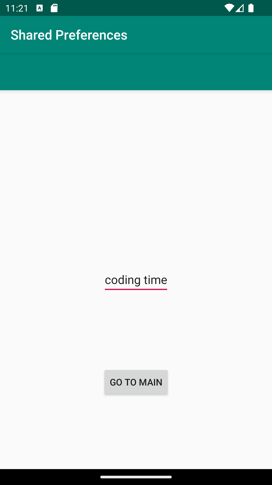

# Rapport

At the beginning I created the shared preferences. I also used "android:onClick" in the xml to make a second activity accessible. In this second activity, I added a EditText field and a button.
When this button was pressed, the following method was run:

    public void startMain(View view) {
        textEditor = (EditText) findViewById(R.id.textEditor);

        String tempText = textEditor.getText().toString();

        SharedPreferences sharedPreferences = getSharedPreferences(SHARED_PREF_NAME, MODE_PRIVATE);
        SharedPreferences.Editor editPrefs = sharedPreferences.edit();
        editPrefs.putString(KEY_TEXT,tempText);
        editPrefs.apply();

        finish();
    }

which added whatever text is present in the EditText field and added it to the shared preference. When the main activity resumed, this text was then added to the prefText view and displayed.

## Följande grundsyn gäller dugga-svar:

- Ett kortfattat svar är att föredra. Svar som är längre än en sida text (skärmdumpar och programkod exkluderat) är onödigt långt.
- Svaret skall ha minst en snutt programkod.
- Svaret skall inkludera en kort övergripande förklarande text som redogör för vad respektive snutt programkod gör eller som svarar på annan teorifråga.
- Svaret skall ha minst en skärmdump. Skärmdumpar skall illustrera exekvering av relevant programkod. Eventuell text i skärmdumpar måste vara läsbar.
- I de fall detta efterfrågas, dela upp delar av ditt svar i för- och nackdelar. Dina för- respektive nackdelar skall vara i form av punktlistor med kortare stycken (3-4 meningar).

Programkod ska se ut som exemplet nedan. Koden måste vara korrekt indenterad då den blir lättare att läsa vilket gör det lättare att hitta syntaktiska fel.

```
    protected void onResume() {
        super.onResume();

        SharedPreferences sharedPreferences = getSharedPreferences(SHARED_PREF_NAME, Context.MODE_PRIVATE);
        savedText = sharedPreferences.getString(KEY_TEXT    , "");

        prefText.setText(savedText);
    }
```

Bilder läggs i samma mapp som markdown-filen.





Läs gärna:

- Boulos, M.N.K., Warren, J., Gong, J. & Yue, P. (2010) Web GIS in practice VIII: HTML5 and the canvas element for interactive online mapping. International journal of health geographics 9, 14. Shin, Y. &
- Wunsche, B.C. (2013) A smartphone-based golf simulation exercise game for supporting arthritis patients. 2013 28th International Conference of Image and Vision Computing New Zealand (IVCNZ), IEEE, pp. 459–464.
- Wohlin, C., Runeson, P., Höst, M., Ohlsson, M.C., Regnell, B., Wesslén, A. (2012) Experimentation in Software Engineering, Berlin, Heidelberg: Springer Berlin Heidelberg.
